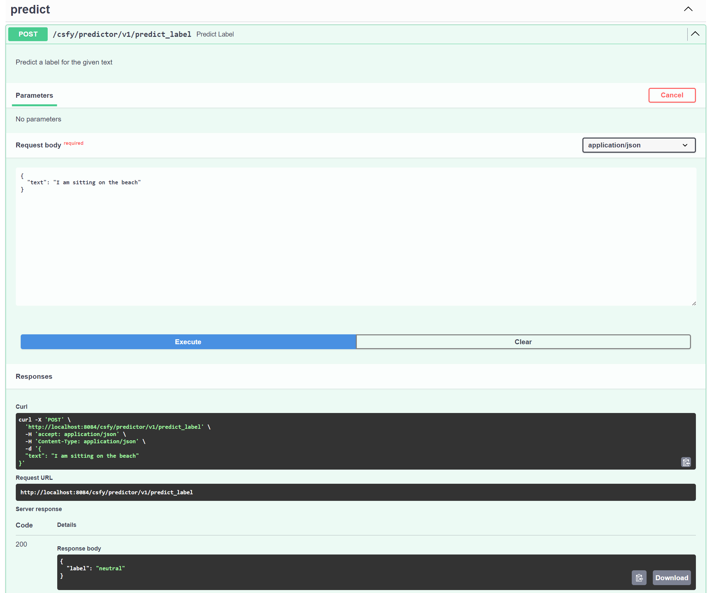

# csfy: A simple text-classifier trainer [ONNX][optimized][language neutral]

Train a simple and fast text classifier, based on [DistilBERT](https://huggingface.co/distilbert/distilbert-base-uncased).

- much faster and lighter than an LLM
- fully configurable, including the base model
- can train on data that has multiple custom labels
- can serve label prediction requests via an OpenAPI REST API

Key points about the base model:

> DistilBERT is a transformers model, smaller and faster than BERT
> This model is uncased: it does not make a difference between english and English.
> this model is primarily aimed at being fine-tuned on tasks that use the whole sentence (potentially masked) to make decisions, such as sequence classification, token classification or question answering.

Key points about BERT (the base model of DistilBERT):

> Pretrained model on English language using a masked language modeling (MLM) objective
> pretrained on the raw texts only, with no humans labeling them in any way (which is why it can use lots of publicly available data)
> the model learns an inner representation of the English language that can then be used to extract features useful for downstream tasks: if you have a dataset of labeled sentences, for instance, you can train a standard classifier using the features produced by the BERT model as inputs

# Example Run

## Training a new classifier

In this example, we train against a data set that has texts with labels.

The data is stored in a parquet file, and looks like this:

| text | label |
|---|---|
| where is the cinema? | NL |
| var x = 123; | code |


```
poetry run csfy train ./data/combined_labelled_is_NL.parquet
```

```
Training model from data at C:\src\github\csfy\data\combined_labelled_is_NL.parquet
=== === ===     [1] Reading input parquet       === === ===
58450 rows of data
WARNING:  - truncated to 100 rows
Saving label mapping to ./models/run-1\label_mapping.json
Map: 100%|█████████████████████████████████████████████████████████████████████████████████████████████████████████████████████████████████████████████████████████████████████████████████████████████████████████| 100/100 [00:00<00:00, 877.20 examples/s]
Some weights of DistilBertForSequenceClassification were not initialized from the model checkpoint at distilbert-base-uncased and are newly initialized: ['classifier.bias', 'classifier.weight', 'pre_classifier.bias', 'pre_classifier.weight']
=== === ===     [2] Training    === === ===
{'eval_loss': 0.5119398832321167, 'eval_runtime': 4.7181, 'eval_samples_per_second': 4.239, 'eval_steps_per_second': 0.212, 'epoch': 1.0}                                                                                                                    
{'train_runtime': 53.3733, 'train_samples_per_second': 1.499, 'train_steps_per_second': 0.094, 'train_loss': 0.6224897861480713, 'epoch': 1.0}                                                                                                                
100%|██████████████████████████████████████████████████████████████████████████████████████████████████████████████████████████████████████████████████████████████████████████████████████████████████████████████████████████| 5/5 [00:53<00:00, 10.67s/it] 
Saving model to ./models/run-1\trained.model
=== === ===     [3] Evaluating  === === ===
100%|██████████████████████████████████████████████████████████████████████████████████████████████████████████████████████████████████████████████████████████████████████████████████████████████████████████████████████████████████| 1/1 [00:00<?, ?it/s]
{'eval_loss': 0.5119398832321167, 'eval_runtime': 4.6233, 'eval_samples_per_second': 4.326, 'eval_steps_per_second': 0.216, 'epoch': 1.0}
Results are at ./models/run-1
[time taken: 0:01:00s]
```

notes on the training output:

- the model is written to `trained.model` under the configured output folder (see 'OUTPUT_DIR' in `config.ini`)
- the training results are written to `results.json`
- the label mappings are written to `label_mapping.json`

## Predicting a label using the new model

Now we can use the trained model to take unseen text, and predict a label.

```
poetry run csfy predict ./models/run-1/trained.model "what is this" --chat
```

```
Loading label mapping from C:\src\github\csfy\models\run-1\label_mapping.json
[time taken: 0:00:00s]
Predicted label: 'NL' - for 'what is this'
How can I help? [to exit, type 'bye' and press ENTER] >> [default is ] >var x = 123
[time taken: 0:00:00s]
code
How can I help? [to exit, type 'bye' and press ENTER] >> [default is ] >how do I get to the beach?
[time taken: 0:00:00s]
NL
```

# Setup

1. Install Python 3.11

2. Install [poetry](https://python-poetry.org/docs#installation)

3. Use poetry to install dependencies

```shell
poetry install
```

# Usage

To see the built-in help:

```
poetry run csfy
```

OUTPUT:

```
Usage: csfy [OPTIONS] COMMAND [ARGS]...

  csfy (classify) is a command line tool to train and run simple text based
  classifiers.

  - for help about each command, add --help. for example:

      csfy train --help

Options:
  -v, --verbose  Enables verbose mode.
  --help         Show this message and exit.

Commands:
  export    Exports a model previously created via the 'train' command, to
            ONNX format.
  predict   Predicts a labal for the given text, using a model previously
            created via the 'train' command.
  quantize  Quantize an existing ONNX model to reduce size and inference time
            whilst mostly preserving accuracy. The quantization level can one
            of: ['q_8', 'q_u8', 'q_f8', 'q_16', 'q_u16'].
  serve     Serve model via a REST API that can accept requests to predict a
            label for given text.
  train     Trains a model to classify text, predicting a label.
```

1. Prepare the dataset

- you need a parquet file with 2 'string' columns: a text column and a label column

2. Edit `config.ini` to suit your environment
- the column names are set in config.ini and can be changed to match your parquet file: `COLUMN_TEXT` and `COLUMN_LABEL`

3. Train
```shell
poetry csfy train <path to input.parquet>
```

4. Test (Predict)
```shell
poetry csfy predict <path to model> <text>
```

Chat mode: (interactive loop)

```shell
poetry csfy predict <path to model> <text> --chat
```

## Optional ONNX conversion [optimized][language neutral]

1. Export to ONNX format

```shell
poetry export <path to model from 'train'> <path to ONNX model to export>
```

2. Reduce model size whilst maintaining most of the accuracy

```shell
poetry quantize <path to ONNX model> <path to output ONNX model> <quantization level>
```

3. Test (Predict) from ONNX model

```shell
poetry csfy predict <path to ONNX model> <text>
```

## Serve label prediction requests with REST API (with Open API spec)

```shell
poetry csfy serve <path to model>
```



# Troubleshooting

- [GPU card not being used](./README.gpu.md)

- `poetry run csfy` does not list any commands
  - try running `poetry install` again or `poetry lock`
  - try running poetry in verbose mode: `poetry run --verbose csfy`

# Example datasets

## Natural language

### Clean

[alpaca](https://huggingface.co/datasets/tatsu-lab/alpaca)

### Toxic

Useful for training a classifier that detects toxic text/prompts:

1. Combined labelled texts

Labelled text - sourced from alpaca, tweets and some synthetic examples.

labels are: [neutral, offensive_language, harmful_behaviour, hate_speech]

[labelled text](https://huggingface.co/datasets/seanius/toxic-or-neutral-text-labelled/tree/main)

2. Harmful requests to an LLM

[harmful_behaviors](https://huggingface.co/datasets/mlabonne/harmful_behaviors)

### Other

[kaggle](https://www.kaggle.com/search?q=datasets)
